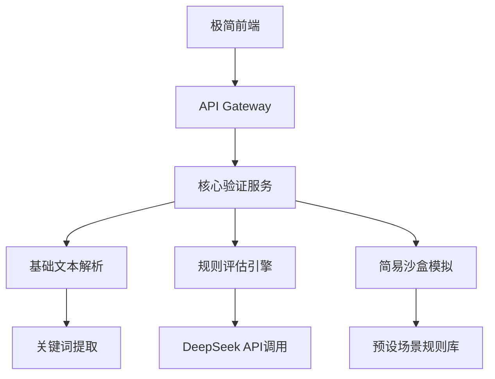

# IdeasAssistant

## 需求背景
现代人脑暴产生的创意呈指数级增长，但受限于时间精力，90%的创意未经有效验证即被搁置。本系统通过AI实现创意自动化预验证，建立量化评估体系，帮助用户聚焦高价值方向。

## 实现方案

### 核心功能模块
1. **智能输入解析**
- 多模态输入支持（文本/语音/脑图）
- 创意要素自动提取（核心价值/目标用户/竞品分析）
- 结构化数据转换（自动生成PRD模板）

2. **AI验证矩阵**
- 可行性评估（技术/法律/伦理）
- 市场预测（LTV模型+竞品数据库比对）
- 快速原型生成（自动生成流程图/UI草图）

3. **智能沙盒测试**
- 自动化用户画像生成
- A/B测试场景构建
- 实时数据看板（转化率/用户留存预测）

### 技术架构


### 开发流程
1. 使用uv创建虚拟环境并配置清华镜像源
2. 基于GitHub Flow进行版本控制
3. CI/CD流程：
   - Pre-commit阶段：执行black/isort代码格式化
   - GitHub Actions自动化：
     - 单元测试（pytest覆盖率>90%）
     - 容器构建（多阶段Dockerfile）
     - Helm Chart打包
4. 监控告警：
   - Prometheus指标采集
   - ELK日志分析
   - 企业微信机器人告警

## 快速启动
```bash
# 安装依赖（使用清华镜像源）
uv pip install -r requirements.txt --index-url https://pypi.tuna.tsinghua.edu.cn/simple

# 运行开发环境
docker-compose -f docker-compose.dev.yml up --build

# 生产环境部署
kubectl apply -f k8s/production
```
